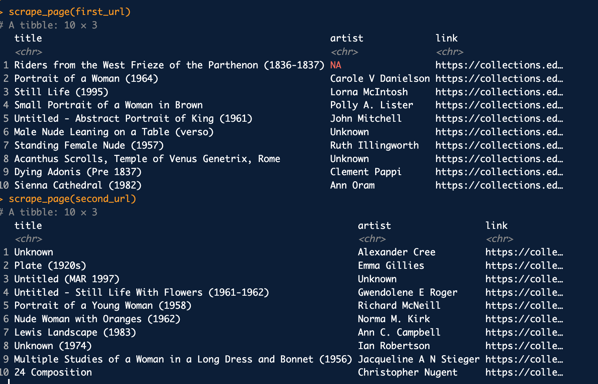

## Load Packages and Data  

First, let's load the necessary packages:  

```{r load-packages, message = FALSE}
library(tidyverse) 
library(skimr)
```

Now, load the dataset. If your data isn't ready yet, you can leave `eval = FALSE` for now and update it when needed.  


```{r load-data, message = FALSE}
# Remove eval = FALSE or set it to TRUE once data is ready to be loaded
uoe_art <- read_csv("data/uoe-art.csv")
```
## Exercise 1
The links we scraped are like "./record/99968?highlight=:", while the URLs in the browser are full URLs that include the domain and path (e.g., "https://collections.ed.ac.uk/art/record/99968?highlight=:"). 

## Exercise 2-4 fixed

## Exercise 5-6
output looks correct. See image of result below.


## Exercises 7-9 
finished

## Exercise 10  

Let's start working with the **title** column by separating the title and the date:  

```{r separate-title-date, error = TRUE}
uoe_art <- uoe_art %>%
  separate(title, into = c("title", "date"), sep = "\\(") %>%
  mutate(year = str_remove(date, "\\)") %>% as.numeric()) %>%
  select(title, artist, year, link)  # Fill in the missing variable!
```

1. “Expected 2 pieces. Additional pieces discarded …”
Some titles contain more than one parenthesis, so separate() finds more than two parts and drops the extras.

2. “Expected 2 pieces. Missing pieces filled with NA …”
Some titles do not contain a year in parentheses, so separate() cannot create a second piece and fills it with NA. 

3. “NAs introduced by coercion”
Some extracted date values are not clean numeric years, so they are converted to numeric results in NA. This is acceptable since we only want valid single years and are okay leaving unclear cases as missing.


## Exercise 11  

```{r}
skim(uoe_art)
```
108 pieces artists info missing.
1575 pieces year info missing


## Exercise 12
```{r}
ggplot(uoe_art %>% filter(!is.na(year)), aes(x = year)) +
  geom_histogram(binwidth = 10) +
  labs(
    title = "Distribution of Artwork Years",
    x = "Year",
    y = "Count"
  )
```

Most artworks cluster in the 20th century, but there appears to be a small outlier near year 0.

## Exercise 13
```{r}
uoe_art %>%
  filter(!is.na(year)) %>%
  arrange(year) %>%
  head(10)
```

The title has two sets of parentheses, “(2)” and “(1964)”, and our code split at the first one. That made it treat “2” as the year instead of “1964,” which is why the histogram showed a weird value near 0.

```{r}
uoe_art_fix <- uoe_art %>%
  mutate(
    year = str_extract(title, "\\d{4}") %>% as.numeric(),
    title = str_remove(title, "\\s*\\(\\d{4}\\)\\s*$") %>% str_squish()
  ) %>%
  select(title, artist, year, link)
```
```{r}
ggplot(uoe_art_fix %>% filter(!is.na(year)), aes(x = year)) +
  geom_histogram(binwidth = 10) +
  labs(
    title = "Distribution of Artwork Years",
    x = "Year",
    y = "Count"
  )
```

##Exercise 14
```{r}
uoe_art %>%
  filter(!is.na(artist)) %>%
  count(artist, sort = TRUE) %>%
  head(5)
```

The most common “artist” in the dataset is Unknown, with 371 pieces. Unknown is probably not a singl artist, instead, this means many works in the collection are unattributed. Excluding Unknown, the most frequently featured named artist is Emma Gillies, with 175 pieces.

## Exercise 15
```{r}
sum(str_detect(tolower(uoe_art$title), "child"))
```
