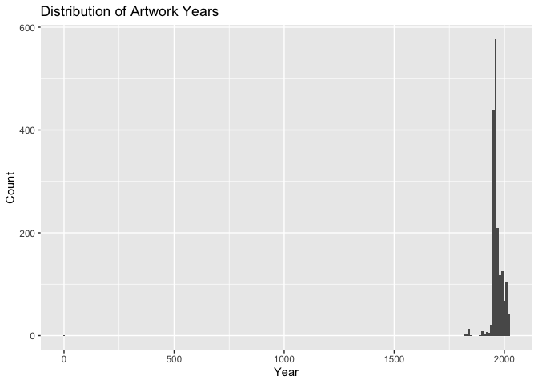
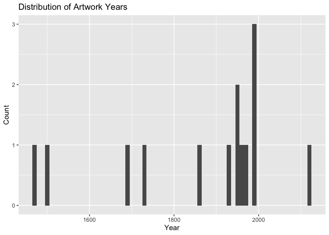

Lab 08 - University of Edinburgh Art Collection
================
Cynthia Deng
02/19/2026

## Load Packages and Data

First, let’s load the necessary packages:

``` r
library(tidyverse) 
library(skimr)
```

Now, load the dataset. If your data isn’t ready yet, you can leave
`eval = FALSE` for now and update it when needed.

``` r
# Remove eval = FALSE or set it to TRUE once data is ready to be loaded
uoe_art <- read_csv("data/uoe-art.csv")
```

## Exercise 1

The links we scraped are like “./record/99968?highlight=:”, while the
URLs in the browser are full URLs that include the domain and path
(e.g., “<https://collections.ed.ac.uk/art/record/99968?highlight=>:”).

## Exercise 2-4 fixed

## Exercise 5-6

output looks correct. See image of result below.


## Exercises 7-9

finished

## Exercise 10

Let’s start working with the **title** column by separating the title
and the date:

``` r
uoe_art <- uoe_art %>%
  separate(title, into = c("title", "date"), sep = "\\(") %>%
  mutate(year = str_remove(date, "\\)") %>% as.numeric()) %>%
  select(title, artist, year, link)  # Fill in the missing variable!
```

    ## Warning: Expected 2 pieces. Additional pieces discarded in 58 rows [124, 336, 365, 390,
    ## 579, 584, 590, 619, 626, 634, 660, 671, 692, 730, 1019, 1346, 1368, 1387, 1431,
    ## 1518, ...].

    ## Warning: Expected 2 pieces. Missing pieces filled with `NA` in 599 rows [4, 8, 11, 20,
    ## 32, 33, 34, 38, 40, 46, 47, 52, 60, 61, 66, 68, 71, 75, 77, 81, ...].

    ## Warning: There was 1 warning in `mutate()`.
    ## ℹ In argument: `year = str_remove(date, "\\)") %>% as.numeric()`.
    ## Caused by warning in `str_remove(date, "\\)") %>% as.numeric()`:
    ## ! NAs introduced by coercion

1.  “Expected 2 pieces. Additional pieces discarded …” Some titles
    contain more than one parenthesis, so separate() finds more than two
    parts and drops the extras.

2.  “Expected 2 pieces. Missing pieces filled with NA …” Some titles do
    not contain a year in parentheses, so separate() cannot create a
    second piece and fills it with NA.

3.  “NAs introduced by coercion” Some extracted date values are not
    clean numeric years, so they are converted to numeric results in NA.
    This is acceptable since we only want valid single years and are
    okay leaving unclear cases as missing.

## Exercise 11

``` r
skim(uoe_art)
```

|                                                  |         |
|:-------------------------------------------------|:--------|
| Name                                             | uoe_art |
| Number of rows                                   | 3321    |
| Number of columns                                | 4       |
| \_\_\_\_\_\_\_\_\_\_\_\_\_\_\_\_\_\_\_\_\_\_\_   |         |
| Column type frequency:                           |         |
| character                                        | 3       |
| numeric                                          | 1       |
| \_\_\_\_\_\_\_\_\_\_\_\_\_\_\_\_\_\_\_\_\_\_\_\_ |         |
| Group variables                                  | None    |

Data summary

**Variable type: character**

| skim_variable | n_missing | complete_rate | min | max | empty | n_unique | whitespace |
|:--------------|----------:|--------------:|----:|----:|------:|---------:|-----------:|
| title         |         0 |          1.00 |   0 | 282 |     1 |     1635 |          0 |
| artist        |       108 |          0.97 |   2 |  55 |     0 |     1202 |          0 |
| link          |         0 |          1.00 |  57 |  60 |     0 |     3321 |          0 |

**Variable type: numeric**

| skim_variable | n_missing | complete_rate |    mean |   sd |  p0 |  p25 |  p50 |  p75 | p100 | hist  |
|:--------------|----------:|--------------:|--------:|-----:|----:|-----:|-----:|-----:|-----:|:------|
| year          |      1575 |          0.53 | 1964.75 | 53.1 |   2 | 1953 | 1962 | 1978 | 2024 | ▁▁▁▁▇ |

108 pieces artists info missing. 1575 pieces year info missing

## Exercise 12

``` r
ggplot(uoe_art %>% filter(!is.na(year)), aes(x = year)) +
  geom_histogram(binwidth = 10) +
  labs(
    title = "Distribution of Artwork Years",
    x = "Year",
    y = "Count"
  )
```

<!-- -->

Most artworks cluster in the 20th century, but there appears to be a
small outlier near year 0.

## Exercise 13

``` r
uoe_art %>%
  filter(!is.na(year)) %>%
  arrange(year) %>%
  head(10)
```

    ## # A tibble: 10 × 4
    ##    title                                      artist         year link          
    ##    <chr>                                      <chr>         <dbl> <chr>         
    ##  1 "Death Mask "                              H. Dempshall      2 https://colle…
    ##  2 "Mary Ann Park Sampler "                   Mary Ann Park  1819 https://colle…
    ##  3 "Fine lawn collar "                        Unknown        1820 https://colle…
    ##  4 "Dying Gaul "                              Unknown        1822 https://colle…
    ##  5 "The Dead Christ "                         Unknown        1831 https://colle…
    ##  6 "Crouching Venus "                         Sarti          1834 https://colle…
    ##  7 "Gates of Paradise "                       Clement Pappi  1835 https://colle…
    ##  8 "Castor and Pollux "                       Sarti          1835 https://colle…
    ##  9 "Metope 29, south entablature, Parthenon " <NA>           1837 https://colle…
    ## 10 "Metope 4, south entablature, Parthenon "  <NA>           1837 https://colle…

The title has two sets of parentheses, “(2)” and “(1964)”, and our code
split at the first one. That made it treat “2” as the year instead of
“1964,” which is why the histogram showed a weird value near 0.

``` r
uoe_art_fix <- uoe_art %>%
  mutate(
    year = str_extract(title, "\\d{4}") %>% as.numeric(),
    title = str_remove(title, "\\s*\\(\\d{4}\\)\\s*$") %>% str_squish()
  ) %>%
  select(title, artist, year, link)
```

``` r
ggplot(uoe_art_fix %>% filter(!is.na(year)), aes(x = year)) +
  geom_histogram(binwidth = 10) +
  labs(
    title = "Distribution of Artwork Years",
    x = "Year",
    y = "Count"
  )
```

<!-- -->

\##Exercise 14

``` r
uoe_art %>%
  filter(!is.na(artist)) %>%
  count(artist, sort = TRUE) %>%
  head(5)
```

    ## # A tibble: 5 × 2
    ##   artist               n
    ##   <chr>            <int>
    ## 1 Unknown            371
    ## 2 Emma Gillies       175
    ## 3 Ann F Ward          23
    ## 4 John Bellany        22
    ## 5 Zygmunt Bukowski    21

The most common “artist” in the dataset is Unknown, with 371 pieces.
Unknown is probably not a singl artist, instead, this means many works
in the collection are unattributed. Excluding Unknown, the most
frequently featured named artist is Emma Gillies, with 175 pieces.

## Exercise 15

``` r
sum(str_detect(tolower(uoe_art$title), "child"))
```

    ## [1] 11
